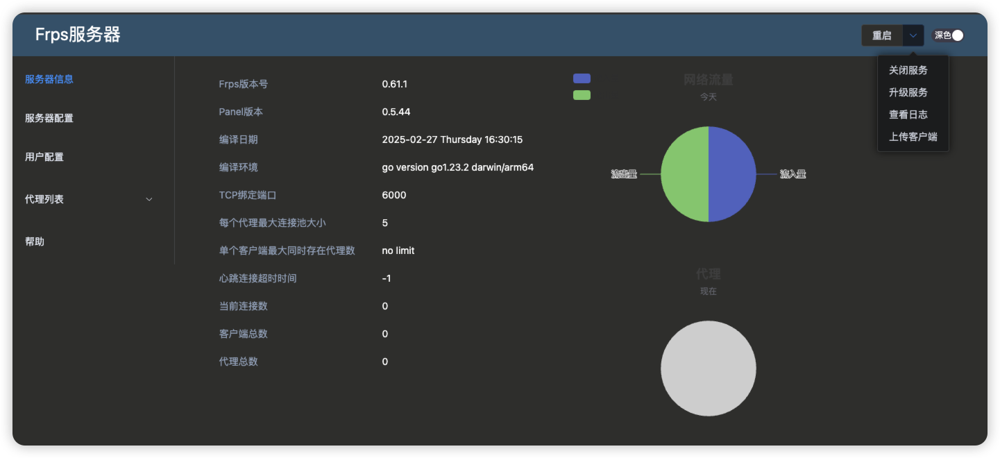
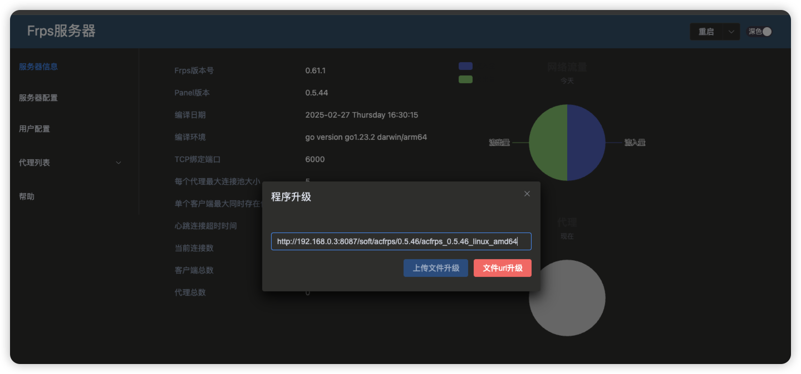
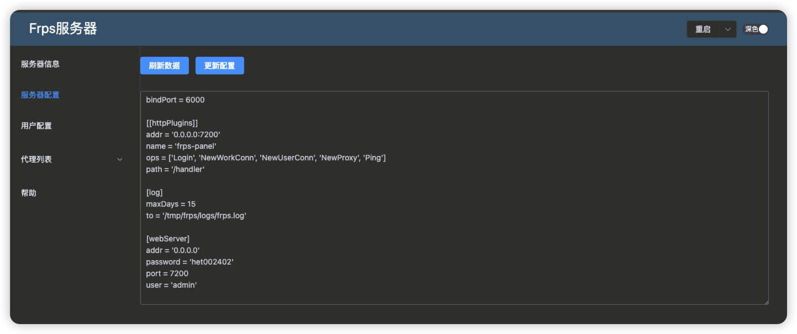
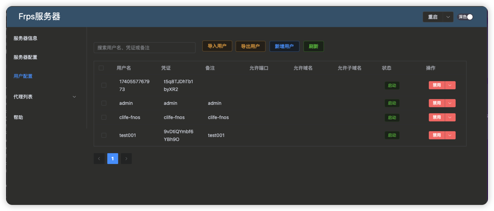
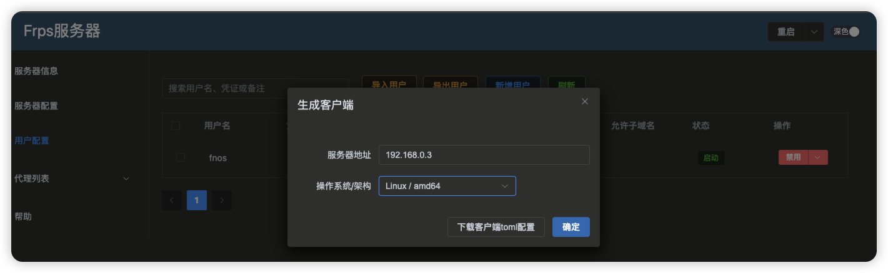

<div align="center">
  
  <h1 align="center">go-frp-panel</h1>
</div>

<div align="center">基于Frp开源代码打造的自定义配置管理📺，自定义配置路径，在线自动升级，免去了配置文件的复杂操作，可实现『✨秒妙极安装体验🚀』</div>
<br>
<p align="center">
  <a href="https://github.com/xxl6097/go-frp-panel/releases/latest">
    
  </a>
  <a href="https://github.com/xxl6097/go-frp-panel/releases/latest">
    
  </a>
  <a href="https://github.com/xxl6097/go-frp-panel/fork">
    
  </a>
</p>


- [✅ 特点](#特点)
- [🔗 最新结果](#最新结果)
- [⚙️ 配置参数](#配置)
- [🚀 快速上手](#快速上手)
    - [工作流](#工作流)
    - [命令行](#命令行)
    - [GUI软件](#GUI-软件)
    - [Docker](#Docker)
- [📖 详细教程](./docs/tutorial.md)
- [🗓️ 更新日志](./CHANGELOG.md)
- [❤️ 赞赏](#赞赏)
- [👀 关注(更新订阅+答疑交流)](#关注)
- [📣 免责声明](#免责声明)
- [⚖️ 许可证](#许可证)

📍订阅源来自：

- [fatedier/frp](https://github.com/fatedier/frp)
## 特点

- ✅ 程序以服务形式安装并运行，支持跨平台windows、linux、macos平台；
- ✅ 新增重启功能，用户可管理后台操作重启；
- ✅ 新增在线升级功能，可上传式升级和文件url式升级；
- ✅ 新增可在管理后台端查看日志功能；
- ✅ frps服务端可生成frpc客户端，密钥信息二进制内嵌在客户端程序中；
- ✅ 新增用户配置，可以配置授权用户供frpc端使用
- ✅ frpc客户端可运行多客户端
- ✨ 新增frpc用户配置导入导出

## 快速上手

### Frps服务端程序安装


#### 命令行

```shell
root@clife-fnos:~/files# chmod +x acfrps_0.5.44_linux_amd64 
root@clife-fnos:~/files# ./acfrps_0.5.44_linux_amd64 install

请输入Frps服务器绑定端口：6000
请输入管理后台端口：7200
请输入管理后台地址(默认0.0.0.0)：
请输入管理后台用户名(admin)：admin
请输入管理后台密码：xxxxx
```

主界面：

<div align="center">
  
</div>

升级界面：
<div align="center">
  
</div>

配置界面：
<div align="center">
  
</div>

用户界面：
<div align="center">
  
</div>

### Frpc客户端程序安装

首先在服务器端新增账户，然后生成客户端（需先在frps端上传客户端），如下图：
生成客户端界面：
<div align="center">
  
</div>

如上如，生成客户端后，上传到电脑端运行，命令如下：

```shell

```

### 命令行

```shell
root@clife-fnos:~/files# chmod +x acfrps_0.5.44_linux_amd64 
root@clife-fnos:~/files# ./acfrps_0.5.44_linux_amd64 install

请输入Frps服务器绑定端口：6000
请输入管理后台端口：7200
请输入管理后台地址(默认0.0.0.0)：
请输入管理后台用户名(admin)：admin
请输入管理后台密码：xxxxx
```


### GUI 软件

1. 下载[go-frp-panel 更新软件](https://github.com/xxl6097/go-frp-panel/releases)，打开软件，点击更新，即可完成更新

2. 或者在项目目录下运行以下命令，即可打开 GUI 软件：

```shell
pipenv run ui
```


### Docker

- go-frp-panel（完整版本）：性能要求较高，更新速度较慢，稳定性、成功率高；修改配置 open_driver = False 可切换到 Lite
  版本运行模式（推荐酒店源、组播源、关键字搜索使用此版本）
- go-frp-panel:lite（精简版本）：轻量级，性能要求低，更新速度快，稳定性不确定（推荐订阅源使用此版本）

#### 1. 拉取镜像

- go-frp-panel

```bash
docker pull guovern/go-frp-panel:latest
```

🚀 代理加速（推荐国内用户使用）：

```bash
docker pull docker.1ms.run/guovern/go-frp-panel:latest
```

- go-frp-panel:lite

```bash
docker pull guovern/go-frp-panel:lite
```

🚀 代理加速（推荐国内用户使用）：

```bash
docker pull docker.1ms.run/guovern/go-frp-panel:lite
```

#### 2. 运行容器

- go-frp-panel

```bash
docker run -d -p 8000:8000 guovern/go-frp-panel
```

- go-frp-panel:lite

```bash
docker run -d -p 8000:8000 guovern/go-frp-panel:lite
```

##### 挂载（推荐）：

实现宿主机文件与容器文件同步，修改模板、配置、获取更新结果文件可直接在宿主机文件夹下操作

以宿主机路径/etc/docker 为例：

- go-frp-panel

```bash
-v /etc/docker/config:/go-frp-panel/config
-v /etc/docker/output:/go-frp-panel/output
```

- go-frp-panel:lite

```bash
-v /etc/docker/config:/go-frp-panel-lite/config
-v /etc/docker/output:/go-frp-panel-lite/output
```

##### 环境变量：

- 端口

```bash
-e APP_PORT=8000
```

- 定时执行时间

```bash
-e UPDATE_CRON="0 22,10 * * *"
```

#### 3. 更新结果

- 接口地址：`ip:8000`
- m3u 接口：`ip:8000/m3u`
- txt 接口：`ip:8000/txt`
- 接口内容：`ip:8000/content`
- 测速日志：`ip:8000/log`

## 更新日志

[更新日志](./CHANGELOG.md)

## 赞赏

<div>开发维护不易，请我喝杯咖啡☕️吧~</div>

| 支付宝                                  | 微信                                      |
|--------------------------------------|-----------------------------------------|
|  |  |

## 关注

微信公众号搜索 Govin，或扫码，接收更新推送、学习更多使用技巧：


## 免责声明

本项目仅供学习交流用途，接口数据均来源于网络，如有侵权，请联系删除

## 许可证

[MIT](./LICENSE) License &copy; 2024-PRESENT [Govin](https://github.com/xxl6097)
